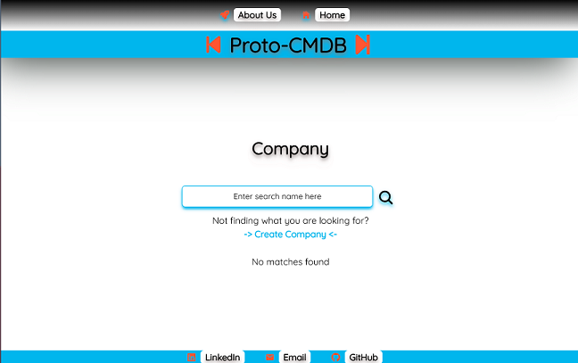
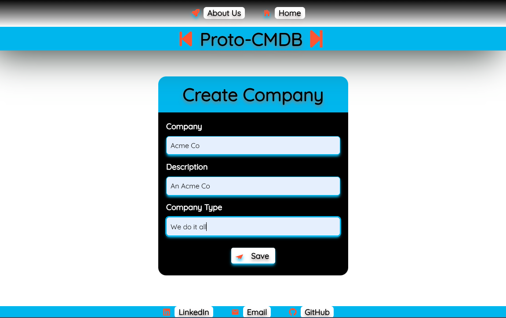
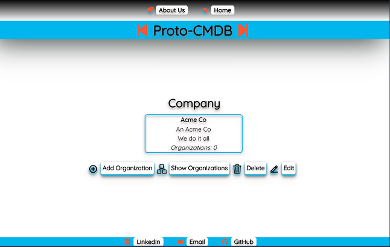
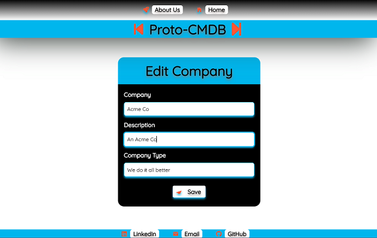
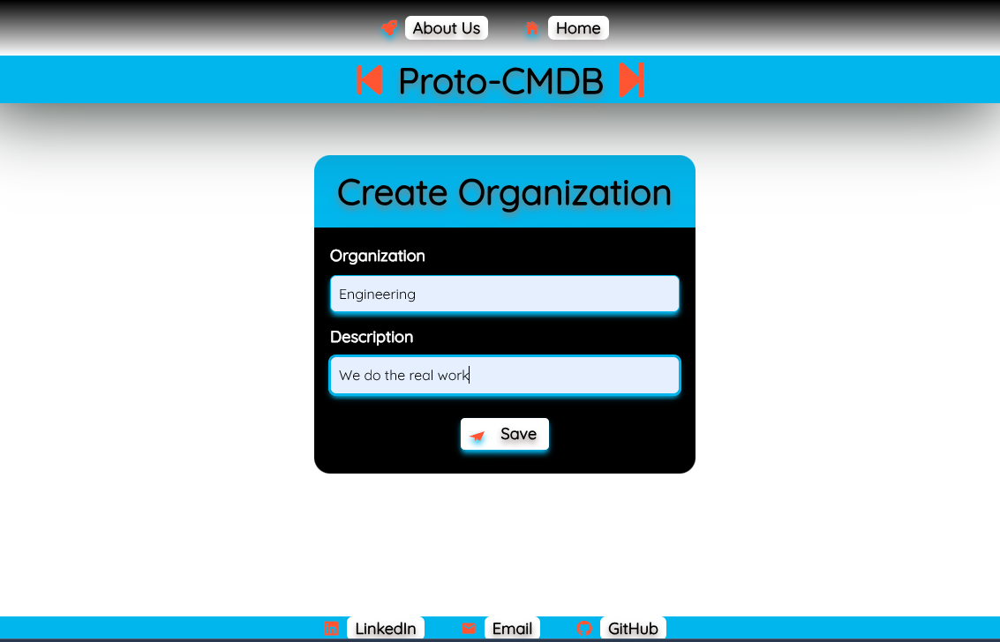
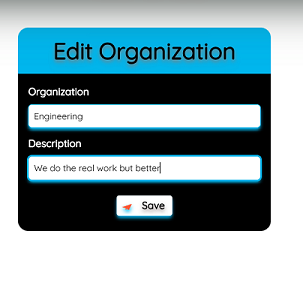
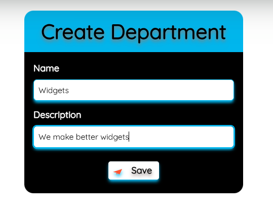
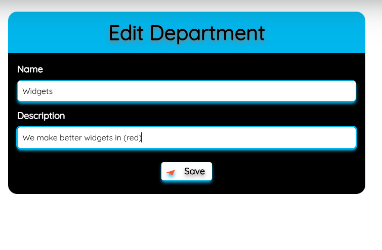
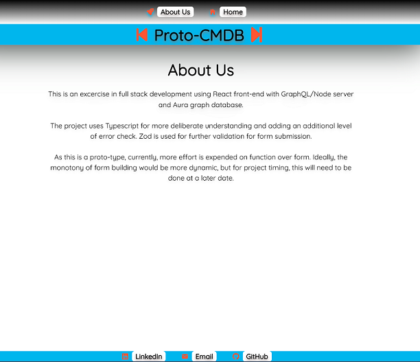

# CMDB Graph Prototype

Playing with Node, React, Typescript, Apollo GraphQL, Neo4J Graph Database (Aura), Cypher, Zod, and Tailwind.

A work in progress

Deployed on Render
https://cmdb-graph-prototype.onrender.com

## Description

This is a work in progress prototype for a cmdb(ish) application. Currently the application is supporting a fully functional organizational tier with create, read, update and delete (CRUD) functions. The additional model items not currently supported by the front-end will be added after spending a minute to step back and formulate a better form building strategy that will scale.

Overall this was a fun little project because I was able to explore graph database from requesting the Aura instance to running through a class or two to figure out how to use Cypher, and then onto developing a data model. Once that was complete, then it was a matter of how to make that work with GraphQl. Having a better understanding of how GraphQL dealt with queries, mutations, inputs, responses, especially how node connections are handled, helped to connect the React/Typescript front-end. It took a minute to understand the dilineation of responsibility between the codegen type generator and myself, ultimately we shook hands and sorted it. I'm really Looking forward to further exploration with this tech stack.

## Table of Contents

- [Tech Stack](#tech-stack)
- [General Functionality](#general-functionality)
- [Screenshots](#screen-shots)
- [Installation](#installation)
- [Usage](#usage)
- [Credits](#credits)
- [License](#licensing)
- [Contributing](#contributing)

### Tech Stack

The portfolio application is built using React and Typescript at the core. TypeScript is used instead of vanilla JS because I prefer to find my mistakes ealy and keep things from being completely open to interpretation. Coming from a Java background, it also makes a lot more practical sense. Tailwind is used for styling, including setting up custom themes and extensions to support the styling needs. I'm still not overly a fan because it does make for some verbosity. React form hook is used for dealing with form handling and Zod is used for validation and additional typing.

Node/Express is serving the GraphQL functionality and uses a Neo4j driver to communicate with a Neo4j Aura graph database.

### General Functionality

The web application will display and allow a user to view About Us and Home.
On the Home screen a search field allows for searching for exiting companies or a link can be selected to create a new company. Once a company is created, an organizations can be added to it, and departments to the organizations. Each item can be updated and deleted using buttons in the button bar when the individual item is displayed. On items having children (i.e. Company and Organization), additional buttons are available creating a new child or deplaying existing children.

### Screen Shots

#### Home/Company

When the page initially loads it defaults to the Home/Company page.

#### Company Create

The user can create a new company.

#### Company Display

The user can view the newly added company and see additional buttons available.

#### Company Edit

The user can edit the company.

#### Organization Create

#### Organization Edit

#### Department Create

#### Department Edit

#### About Us

A small blurb about the project can be found on the About Us page/link

### Installation

1.  Install Node.js version 20.x or newer
2.  Clone https://github.com/ericroys-school/cmdb-graph-prototype.git
3.  `cd` into the `cmdb-graph-prototype` directory
4.  Run `npm run install` to load all the project dependencies for the client and server
5.  Get yourself a free instance of Aura graph database from [Neo4j](https://neo4j.com)
6.  Create a .env file in the server/src directory (see sample env.sample already there)
7.  Run the program in development locally via `npm run dev`

### Usage

If you are using from local installation then open the page at http://localhost:4000/graphql.
There is an existing deployment via Render @ https://cmdb-graph-prototype.onrender.com which is free so if it connects slow the first time, or there is a few bits of timeouts retrieving data, have patience, be kind, grab more coffee and think about running it locally.

### Credits

No kittens, puppies, armadillos, otter, or octopi were harmed in the making of this project.

### Licensing

As per always, this repo is licensed with [The Unlicense](http://choosealicense.com/licenses/unlicense) so feel free to do whatever. Share with your kids, dogs, neighbors, mail carrier, etc. Have a nice day!

### Contributing

Feel free to reach out via email @ eric.roys@gmail.com if you are interested in a chat about any of the tech used, design decisions, etc. Tanks, Sherman!
